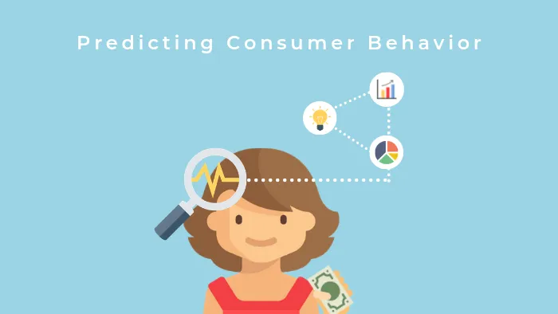
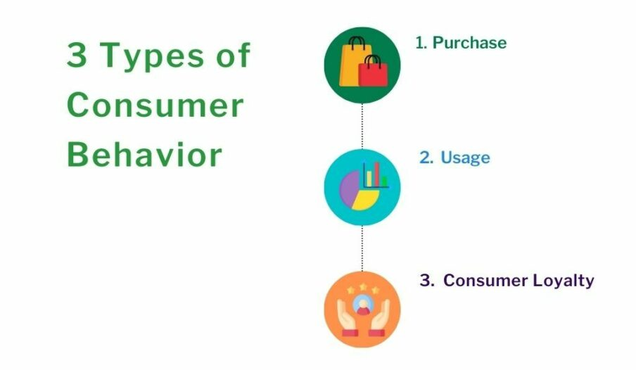

# Customer Purchase Behavior Prediction

---
## Introduction

This dataset contains information on customer's purchase behavior across various attributes, aiming to help data scientist and analyst understand the factors influencing purchase decisions. This includes demographic information, purchasing habits, and other relevant features. 

The following features in our dataset are:
* **Age**
* **Gender**
* **Annual Income**: Annual income of the customer in dollars
* **Number of Products**: Total number of purchases by the customer
* **Product Category**: 0-Electronics, 1-Clothing, 2-Home Goods, 3-Beauty, 4-Sporting Goods
* **Time Spent on Website**: Time spent by the customer on the website in minutes
* **Loyalty Program**: Whether the customer have loyalty program (0-No, 1-Yes)
* **Discount Availed**: Number of discount availed (range: 0-5)
* **Purchase Status**: Likelihood of the customer making a purchase (0-No, 1-Yes)
---
## Business Question
For this business question: *Will our upcoming customer make a purchase from our website?*

---
## Data Approach
Based on the business question, this indicates that this is a classification problem because we want to know if the customer is willing to make a purchase from a online website. 

---
## Data Requirement
This dataset requires the domain knowledge of retail since this dataset contains information that is needed for our research such as *Age*, *Gender*, *Product Category*, *Loyalty Program*, and *Purchase Status*.

---
## Data Collection
The dataset is collected from [Kaggle](https://www.kaggle.com/datasets/rabieelkharoua/predict-customer-purchase-behavior-dataset/data) by downloading a CSV file and imported into Jupyter Notebook using Python.

---
## Data Understanding
We start creating a data visualization for each features of our dataset. The first visual was a bar chart that counts the target variable, *Purchase Status* where 0 is not purchased and 1 is purchased, that it shows that the non-purchase has the higher count than confirmed purchase. 

The *Age* distribution showed that it is in range of 18-70 years old, but there is no significant age in this distribution. Then we plot a *gender* bar chart; which it shows that there is more female customers than male customers.

The *Annual Income* distribution shows the range of \$20,000 - \$150,000, but there is no significant annual income distribution since the distribution shows a uniform modal.

The *Number of Products* distribution shows the range of 0-20 items purchased in each customer, and the most significant amount of customers buy is 10 to 15 items purchased. We also looked at the count of *Product Category*, and it seems that clothing is the highest count. 

Lastly, we created a heatmap of our dataset to find any indication of high correlation to our target variable, *Purchase Status*. Based on the heatmap, we see that the *Time Spent on Website*, *Loyalty Program*, and *Discount Availed* are highly correlated to *Purchase Status*.

Based on our data understanding, we see that *Age* is irrelevant to our problem. We can conclude that *Loyalty Program* and *Discount Availed* are more likely for customer's to make a purchase because many customers want deals to save them some money from the product's regular price and store's shipping fee.

---
## Data Preparation
We split the data into features ($X$) and target value ($y$). Then we are scaling the features before we start splitting the data. Lastly, we split the data into training and testing sets, so we can start building our model.

---

## Modeling
In this modeling section, we built five models that are classification model because our target variable, *Purchase Status*, represent as a binary indicator. The following models being used for this problem are:
* Decision Tree (DT)
* Logistic Regression (LR)
* Gausian Naive-Bayes (NB)
* Support Vector Machine (SVM)
* Random Forest (RF)

For each model, we initialize the model type into an object. Then we fit our training sets into the model, and predict our test set before we evaluate our model.

---
## Evaluation
We evaluate our model by accuracy, precision, recall and F1 score and also display confusion matrix for each model. 

|  |DT|LR|SVM|NB|RF|
|:-:|:-:|:-:|:-:|:-:|:-:|
|Accuracy Score|0.90|0.84|0.87|0.84|0.95|
|Precision Score|0.91|0.88|0.89|0.88|0.99|
|Recall Score|0.84|0.72|0.80|0.71|0.90|
|F1 Score|0.87|0.79|0.84|0.79|0.94|

---
## Conclusion
The Random Forest Classifier emerged as the best model for predicting customer behavior, achieving an accuracy score of 95.33%. It also demonstrated high precision of 99.14%, effectively identifying customers likely to make a purchase, and recall of 90%, capturing portions of actual purchasers. With an F1 score of 94.26%, the Random Forest model proved to be both reliable and robust for this task.